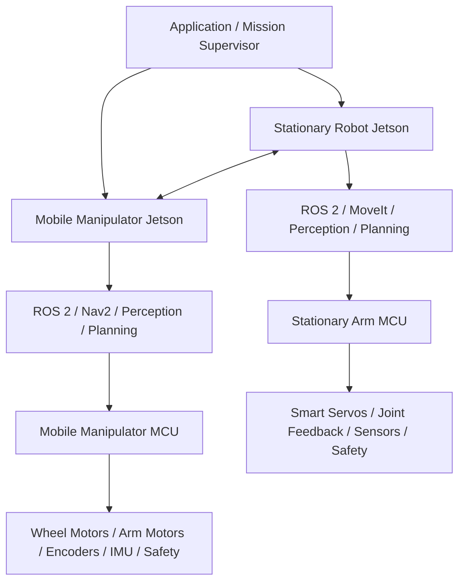

# Robotics Portfolio — 9-Month Development Reference

**Owner:** Ercan  
**Project type:** Solo robotics engineering portfolio / proof-of-capability platform  
**Primary goal:** Build a credible, technically deep portfolio that demonstrates the ability to design, implement, integrate, test, and document robotic systems from embedded control up to autonomous multi-robot behavior.  
**Planned duration:** 9 months  
**Recommended workload:** 12–15 hours/week average  
**Primary hardware sequence:** Stationary robot arm first (RoArm M3 with custom ESP32 firmware) → mobile manipulator later  
**Primary compute architecture:** Jetson + microcontroller per robot  
**Core strengths emphasized:** Embedded systems, feedback control, sensor fusion, robot integration, ROS 2, perception, navigation, manipulation, experimentation, system reliability

---

## 1. Purpose of This Document

This README is the main engineering reference for the complete nine-month portfolio project.

It should be treated as a **living document**. The project is expected to evolve as:

- hardware limitations become clearer,
- experiments reveal better design choices,
- new customer requirements appear,
- some advanced techniques prove unnecessary,
- some stretch goals become practical,
- budget constraints change.

The goal is not to follow every line rigidly. The goal is to preserve the **engineering direction** of the project while keeping scope under control.

A strong portfolio is not created by implementing the largest number of algorithms. It is created by showing that you can:

1. define a robotics problem,
2. design a clean architecture,
3. build reliable embedded control,
4. integrate sensors and compute layers,
5. choose appropriate algorithms,
6. evaluate them quantitatively,
7. handle failures,
8. document decisions,
9. build a complete working robotic application.

---

# 2. Final Portfolio Vision

By the end of Month 9, the portfolio should demonstrate two robotic platforms using a shared architecture:

1. **Stationary Robot Arm**
2. **Mobile Manipulator**

Each robot should contain:

- a low-level microcontroller layer,
- a high-level Jetson / Linux layer,
- ROS 2 integration,
- logging and diagnostics,
- safety and fault handling,
- reusable communication infrastructure.

The two robots should collaborate in at least one integrated scenario.

A second scenario should demonstrate a different technical capability, especially precision, perception, adaptation, or control.

---

## 2.1 Target System Architecture



The architecture should communicate a clear separation:

### Microcontroller
Responsible for deterministic and hardware-near tasks:

- actuator interfacing,
- joint-state acquisition from actuator feedback or local sensors,
- real-time command scheduling and control loops supported by the hardware,
- basic filtering,
- watchdogs,
- limit enforcement,
- hardware safety states,
- timestamped telemetry,
- low-level communication.

For the initial stationary-arm platform, the microcontroller is the ESP32 already on the RoArm M3.
The project will not rely on Waveshare firmware.
The goal is to implement custom firmware with a platform-independent architecture and a RoArm-specific smart-servo backend.
This first backend owns protocol handling, command scheduling, telemetry, safety, and joint abstraction, but it does not assume raw PWM/current control of each servo.

### Jetson
Responsible for computationally heavier or non-hard-real-time tasks:

- ROS 2,
- perception,
- sensor fusion,
- navigation,
- motion planning,
- high-level control,
- task orchestration,
- data logging,
- visualization,
- customer-specific logic.

---

# 3. Portfolio Positioning

The portfolio should not communicate:

> “I bought two inexpensive robots and made them move.”

It should communicate:

> “I designed and implemented a reusable robotics architecture spanning embedded control, sensor integration, estimation, perception, planning, feedback control, autonomous execution, and multi-robot coordination.”

The inexpensive robots are development platforms.

The engineering capability is the product.

---

# 4. Scope Management

The project must be divided into three priority levels.

## 4.1 MUST — Required for a successful portfolio

These items should be completed unless prevented by hardware limitations.

### Embedded
- MCU hardware abstraction
- actuator interface
- joint-state acquisition from smart-servo feedback or local sensors
- watchdog
- fault-state handling
- command protocol
- telemetry
- reusable firmware structure
- platform capability abstraction

### Stationary robot
- joint-space feedback control
- trajectory generation
- forward kinematics
- inverse kinematics
- Jacobian understanding
- ROS 2 interface
- MoveIt integration
- camera calibration
- robot-camera calibration
- vision-guided manipulation
- one polished standalone scenario

### Mobile manipulator
- wheel velocity control
- odometry
- IMU integration
- EKF-based localization or state estimation
- ROS 2
- Nav2
- autonomous navigation
- docking
- manipulation after docking
- communication with stationary robot

### System-level
- state machine or behavior-based orchestration
- error handling
- retries
- timeouts
- logging
- quantitative measurements
- documentation
- videos
- final portfolio website / repository structure

---

## 4.2 SHOULD — High-value advanced work

Complete these if the core system is stable.

- visual servoing
- MPC comparison for mobile tracking
- computed-torque control if torque-level access exists
- advanced docking controller
- automated experiment scripts
- reproducible calibration workflow
- multi-robot job protocol
- behavior trees
- additional failure recovery logic
- sensor-fusion comparisons

---

## 4.3 STRETCH — Optional research-oriented extensions

Do not let these delay core completion.

- impedance control
- admittance control
- whole-body mobile manipulation
- visual-inertial odometry
- custom SLAM
- custom grasp planner
- force-controlled insertion
- advanced task planning
- optimization-based whole-body QP control
- deep-learning grasp detection
- learned control
- digital twin
- automated deployment tooling

---

# 5. Recommended Weekly Workload

## 5.1 Nominal target

**12–15 hours/week**

This is the recommended long-term average.

A practical distribution:

| Activity | Hours/week |
|---|---:|
| Implementation | 7–8 |
| Theory / papers | 2 |
| Experiments / debugging | 2–3 |
| Documentation | 1–2 |
| **Total** | **12–15** |

Some integration weeks may temporarily rise to 16–18 hours.

Avoid planning for 20+ hours every week.

---

## 5.2 Weekly rule

At the end of each week ask:

> **What can the robot do now that it could not do last week?**

A good weekly outcome is an observable capability.

Examples:

- joint feedback readings are reliable,
- one joint follows a target,
- trajectory tracking works,
- FK agrees with physical measurements,
- Jetson receives telemetry,
- camera detects a target,
- robot reaches a visually detected object,
- mobile robot localizes,
- docking error is below a threshold,
- two robots complete a handoff.

---

# 6. Spending Strategy

The project should intentionally spread spending over time.

## Month 1
Buy:

- stationary robot arm,
- debug / recovery interface for the onboard ESP32 if needed,
- required power components,
- communication interface,
- emergency-stop / disable mechanism if practical,
- basic electronics,
- basic gripper if needed.

## Month 2
Buy only small supporting parts:

- cables,
- connectors,
- level shifters,
- encoders if needed,
- interface boards,
- simple sensors.

## Month 3
Buy Jetson #1 only if PC-based development is no longer sufficient.

## Month 4
Buy first vision sensor:

- RGB camera,
- stereo camera,
- or depth camera depending scenario needs.

## Month 5
Only small upgrades:

- gripper fingers,
- fixtures,
- calibration targets,
- markers,
- test objects.

## Month 6
Buy mobile manipulator.

## Month 7
Buy navigation-specific sensors if needed:

- IMU,
- LiDAR,
- wheel encoder upgrades,
- depth sensor,
- MCU #2.

## Month 8
Buy Jetson #2 and scenario-specific components.

## Month 9
Buy only missing or replacement items.

---

# 7. Hardware Selection Principles

## 7.1 Stationary arm

Prioritize:

1. accessible control interface,
2. joint-state feedback,
3. documented protocol,
4. ROS compatibility or at least a usable SDK,
5. repeatability,
6. payload sufficient for small demo objects,
7. stable mechanical construction,
8. replaceable / serviceable parts.

A cheap arm with an open protocol is better for this project than a mechanically superior arm hidden behind a closed controller.

Selected initial platform: **RoArm M3** with custom firmware on the onboard ESP32 and direct control of the smart-servo communication path.

Implication:

- the first firmware backend should target smart servos rather than raw motor drivers,
- the embedded architecture must stay platform-independent so a future low-level motor backend can be added,
- torque/current-level manipulator control is deferred until later hardware supports it.

---

## 7.2 Microcontroller

Preferred capabilities:

- sufficient timers,
- UART for smart-servo communication,
- encoder interfaces when future hardware needs them,
- PWM when future hardware needs it,
- ADC,
- DMA,
- SPI,
- I2C,
- CAN if possible,
- enough RAM / flash,
- real-time interrupt support,
- FreeRTOS compatibility,
- good debugging interface.

Initial platform target: **ESP32** on the RoArm M3.

Future portable targets may include STM32-class MCUs or other FreeRTOS-capable controllers.

---

## 7.3 Jetson

The Jetson does not need to be purchased immediately.

It becomes useful when the project requires:

- ROS 2 deployment on dedicated hardware,
- camera pipelines,
- CUDA,
- neural inference,
- multi-process robotic software,
- onboard navigation.

---

# 8. Repository Architecture

Recommended top-level structure:

```text
robotics-portfolio/
│
├── README.md
├── docs/
│   ├── architecture/
│   ├── decisions/
│   ├── experiments/
│   ├── calibration/
│   └── reports/
│
├── firmware/
│   ├── core/
│   ├── drivers/
│   ├── estimation/
│   ├── control/
│   └── platforms/
│
├── ros2_ws/
│   └── src/
│
├── stationary_arm/
├── mobile_manipulator/
├── scenarios/
│   ├── scenario_1_material_handling/
│   └── scenario_2_precision_manipulation/
│
├── simulation/
├── tools/
│   ├── logging/
│   ├── plotting/
│   └── calibration/
│
├── experiments/
├── media/
└── references/
```

---

# 9. Firmware Architecture

The firmware should maximize reuse.

```text
firmware/
│
├── core/
│   ├── scheduler/
│   ├── state_machine/
│   ├── watchdog/
│   ├── communication/
│   ├── diagnostics/
│   └── timebase/
│
├── drivers/
│   ├── actuator/
│   ├── smart_servo/
│   ├── encoder/
│   ├── imu/
│   ├── adc/
│   ├── motor/
│   ├── gpio/
│   └── transport/
│
├── control/
│   ├── pid/
│   ├── feedforward/
│   ├── trajectory/
│   ├── saturation/
│   └── limits/
│
├── estimation/
│   ├── filters/
│   └── velocity_estimation/
│
└── platforms/
    ├── stationary_arm_roarm_m3/
    └── mobile_manipulator/
```

Platform-specific code should be minimized.

---

# 10. Communication Architecture

Recommended message categories:

## Commands
- set joint target
- set joint trajectory point
- set wheel velocity
- enable
- disable
- reset fault
- set controller parameters
- execute trajectory segment

## Telemetry
- joint position
- joint velocity
- wheel velocity
- IMU data
- actuator current / load if available
- controller state
- system timestamp
- temperature if available

## Diagnostics
- communication status
- watchdog state
- fault code
- dropped packet count
- timing error
- control-loop overruns

---

# 11. Month-by-Month Plan

---

# MONTH 1 — Stationary Arm Bring-Up

## Main objective

Establish complete communication with the stationary arm and create a dependable custom ESP32 firmware foundation around smart-servo actuation and joint feedback.

## Primary questions

- Can I command each joint?
- Can I read each joint?
- Can I communicate directly with each smart servo from my own firmware?
- What feedback is available?
- What are the actuator limits?
- What is the actual achievable control frequency?
- What faults occur?
- How repeatable is the system?

---

## Week 1 — Hardware understanding

### Actions

- inspect mechanical construction,
- identify actuators,
- identify feedback sensors,
- map the onboard ESP32 role and flashing / recovery path,
- identify the smart-servo communication path,
- document communication method,
- determine voltage and current requirements,
- verify joint ranges,
- verify payload limitations,
- identify emergency stopping method.

### Deliverables

- hardware block diagram,
- electrical connection diagram,
- initial BOM,
- interface notes,
- risk list.

---

## Week 2 — Communication and sensing

### Actions

Implement:

- direct smart-servo communication from the ESP32,
- actuator discovery / ID mapping,
- command parser,
- joint-state acquisition,
- timestamping,
- PC logging.

Create a simple CLI or Python tool to:

- read joint positions,
- command low-speed movement,
- save data.

### Exit criteria

PC ↔ custom ESP32 firmware ↔ smart servos communication works reliably.

---

## Week 3 — First joint-control characterization

For one joint:

1. identify response to position commands,
2. measure latency and repeatability,
3. determine usable command/update rate,
4. add rate limiting and command shaping,
5. evaluate whether an outer-loop correction layer is useful,
6. keep inner-loop ownership at the servo only until later hardware allows more.

### Baseline equations

\[
e(t)=q_d(t)-q(t)
\]

\[
q_c(t)=f(q_d(t), \text{limits}, \text{timing})
\]

where \( q_c(t) \) is the command sent to the smart servo after command shaping and safety checks.

If the measured interface supports it reliably, an outer-loop correction layer may later be added:

\[
q_c(t)=q_d(t)+K_p\left(q_d(t)-q(t)\right)
\]

### Required protections

- command saturation,
- joint limit checks,
- communication timeout handling,
- derivative filtering if an outer loop is used,
- watchdog.

### Measurements

- rise time,
- settling time,
- overshoot,
- steady-state error,
- command latency,
- RMS tracking error.

---

## Week 4 — Multi-joint bring-up

### Actions

- repeat characterization on all joints,
- synchronize command scheduling and feedback sampling,
- implement joint-state structure,
- add controller configuration,
- introduce state machine.

Suggested states:

```text
BOOT
CALIBRATION
IDLE
READY
RUNNING
FAULT
ESTOP
```

### Month 1 exit criteria

- every joint is commandable,
- every joint is measurable,
- custom ESP32 firmware is stable,
- joint command and feedback behavior is characterized,
- faults are detectable,
- data logging works,
- first engineering report is written.

---

# MONTH 2 — Embedded Control Framework

## Main objective

Transform experimental code into a reusable, platform-independent robotics firmware platform with the RoArm smart-servo backend as the first implementation.

---

## Week 5 — Software cleanup

Refactor:

- hardware abstraction,
- actuator abstraction,
- smart-servo driver,
- drivers,
- scheduler,
- diagnostics,
- communication,
- controller modules.

Add coding conventions and error handling.

---

## Week 6 — Real-time scheduling

Create task groups.

Example:

### Fast
- actuator feedback polling
- actuator command scheduling
- safety checks

### Medium
- velocity estimation
- safety
- outer-loop controller update if used

### Slow
- communication
- diagnostics
- logging

Measure:

- execution time,
- loop jitter,
- missed cycles.

Do not select control frequencies only because they sound impressive.

Use what the real hardware supports reliably.

---

## Week 7 — Trajectory generation

Implement at least:

- trapezoidal velocity profile,
- cubic polynomial trajectory,
- quintic polynomial trajectory.

Example quintic boundary conditions:

\[
q(0)=q_0
\]

\[
q(T)=q_f
\]

\[
\dot q(0)=\dot q(T)=0
\]

\[
\ddot q(0)=\ddot q(T)=0
\]

Compare smoothness, tracking, and actuator behavior.

Treat the RoArm implementation as the first backend of a generic actuator interface rather than the final shape of the firmware.

---

## Week 8 — Benchmarking

Run repeatable experiments.

Record:

- desired position,
- actual position,
- desired velocity,
- actual velocity,
- actuator command,
- controller state,
- timestamp.

Generate plots.

### Month 2 exit criteria

The arm executes repeatable synchronized trajectories using the new firmware framework and the custom RoArm backend.

---

# MONTH 3 — Robot Modelling, Kinematics, ROS 2

## Main objective

Move from actuator-level control to robot-level control.

---

## Week 9 — Forward kinematics

Define coordinate frames.

Create DH or MDH model.

General transform:

\[
{}^0T_n =
{}^0T_1
{}^1T_2
...
{}^{n-1}T_n
\]

Validate using real measurements.

### Measurement

Compare predicted end-effector position against measured position.

---

## Week 10 — Jacobian and inverse kinematics

Study:

\[
\dot x = J(q)\dot q
\]

Implement:

- numerical IK,
- pseudoinverse method.

Basic solution:

\[
\dot q = J^\dagger \dot x
\]

Add damped least squares:

\[
J^\#=J^T(JJ^T+\lambda^2I)^{-1}
\]

Study:

- singularities,
- joint limits,
- convergence.

---

## Week 11 — ROS 2 model

Create:

- URDF / Xacro,
- TF tree,
- joint state publisher,
- robot state publisher.

Verify in RViz.

---

## Week 12 — Hardware integration

Create the interface between ROS 2 and your MCU / robot controller.

Target architecture:

```text
MoveIt
  ↓
ros2_control
  ↓
custom hardware interface
  ↓
custom ESP32 firmware
  ↓
smart servos
```

### Month 3 exit criteria

The physical robot can be commanded from ROS 2 and visualized correctly in RViz.

---

# BUFFER WEEK A

Do not add new features.

Fix:

- unstable communication,
- bad transforms,
- controller oscillation,
- software architecture,
- poor naming,
- missing documentation,
- hardware wiring.

---

# MONTH 4 — Vision and Calibration

## Main objective

Allow the stationary robot to act on objects whose pose is not hardcoded.

---

## Week 13 — Camera bring-up

Create stable image acquisition.

Measure:

- frame rate,
- latency,
- resolution,
- dropped frames.

---

## Week 14 — Intrinsic calibration

Estimate camera matrix:

\[
K=
\begin{bmatrix}
f_x&0&c_x\\
0&f_y&c_y\\
0&0&1
\end{bmatrix}
\]

Also estimate lens distortion.

Store calibration reproducibly.

---

## Week 15 — Robot-camera calibration

Study:

- eye-in-hand,
- eye-to-hand,
- hand-eye calibration,
- AX = XB methods.

Example transform chain:

\[
{}^{base}T_{object}
=
{}^{base}T_{camera}
{}^{camera}T_{object}
\]

Validate by placing a known target at multiple positions.

---

## Week 16 — Object pose estimation

Start simple.

Recommended progression:

1. fiducial marker,
2. known geometric object,
3. classical CV,
4. learned detector only if needed.

### Month 4 exit criteria

The system can detect an object, transform its pose into robot coordinates, and move toward it.

---

# MONTH 5 — Scenario 0 / Stationary-Arm Portfolio Project

## Project name

**Vision-Guided Flexible Pick-and-Place Cell**

This is the first complete portfolio-grade project.

---

## Week 17 — Manipulation state machine

Recommended states:

```text
IDLE
DETECT
LOCALIZE
PLAN
APPROACH
GRASP
VERIFY
TRANSFER
PLACE
VERIFY
DONE
RECOVERY
```

Every state needs:

- success,
- failure,
- timeout,
- recovery.

---

## Week 18 — Motion planning

Use:

- MoveIt,
- planning scene,
- collision objects,
- joint limits,
- safe approach / retreat.

Avoid hardcoded direct jumps.

---

## Week 19 — Robustness

Create controlled failures:

- object not detected,
- target moved,
- grasp failed,
- trajectory failed,
- communication interrupted.

Implement recovery logic.

---

## Week 20 — Validation and case study

Measure:

- object pose error,
- end-effector final error,
- success rate,
- repeatability,
- cycle time,
- grasp success,
- recovery success.

Create:

- demo video,
- architecture diagram,
- technical report,
- experiment plots.

---

# DECISION GATE 1 — End of Month 5

Before purchasing the mobile manipulator, review:

## Technical
- Is the firmware architecture reusable?
- Is the Jetson/MCU split working?
- Is the stationary scenario reliable?
- Are logging and experiments good enough?

## Budget
- Can the next hardware phase be funded safely?

## Portfolio
- Is the first project already useful as proof of capability?

## Customer direction
- Have any early conversations suggested a better Scenario 2?

Only after this review should the second major robot purchase be finalized.

---

# MONTH 6 — Mobile Manipulator Bring-Up

## Main objective

Reuse the existing architecture on a second robot.

---

## Week 21 — Mechanical and electrical bring-up

Document:

- wheel geometry,
- wheel radius,
- track width,
- encoders,
- motor drivers,
- manipulator interface,
- IMU,
- power system.

---

## Week 22 — Port reusable firmware

Reuse:

- communication,
- watchdog,
- logging,
- state machine,
- diagnostics,
- controller infrastructure.

Add platform-specific drivers.

---

## Week 23 — Wheel velocity control

For a differential-drive system:

\[
v=\frac{r}{2}(\omega_R+\omega_L)
\]

\[
\omega=\frac{r}{L}(\omega_R-\omega_L)
\]

Kinematics:

\[
\dot x=v\cos\theta
\]

\[
\dot y=v\sin\theta
\]

\[
\dot \theta=\omega
\]

Implement wheel feedback control.

---

## Week 24 — Odometry characterization

Measure:

- straight-line error,
- rotational error,
- drift,
- left/right asymmetry,
- wheel slip,
- encoder bias.

### Month 6 exit criteria

The base accepts velocity commands, drives repeatably, and produces odometry.

---

# MONTH 7 — Sensor Fusion and Autonomous Navigation

## Main objective

Create a reliable autonomous mobile platform.

---

## Week 25 — IMU characterization

Measure:

- accelerometer bias,
- gyro bias,
- noise,
- drift,
- stationary stability.

Document sensor frame orientation.

---

## Week 26 — EKF

Baseline fusion:

```text
Wheel odometry
      \
       → EKF → pose estimate
      /
     IMU
```

Possible state:

\[
x =
\begin{bmatrix}
p_x &
p_y &
\theta &
v &
\omega &
b_g
\end{bmatrix}^T
\]

Prediction:

\[
x_k=f(x_{k-1},u_k)+w_k
\]

Measurement:

\[
z_k=h(x_k)+v_k
\]

Covariance prediction:

\[
P_{k|k-1}=F P_{k-1|k-1}F^T+Q
\]

Kalman gain:

\[
K=P H^T(HPH^T+R)^{-1}
\]

Correction:

\[
x_{k|k}=x_{k|k-1}+K(z-Hx)
\]

### Recommended process

1. implement in Python / MATLAB,
2. validate on logged data,
3. compare with ROS implementation,
4. use robust ROS integration in final system if appropriate.

---

## Week 27 — Navigation stack

Integrate:

- localization,
- map,
- global planning,
- local control,
- obstacle handling,
- velocity command output.

Use Nav2 as the high-level framework.

---

## Week 28 — Tracking control study

Baseline:

- standard Nav2 controller,
- pure-pursuit style tracking.

Advanced comparison:

- MPC if time allows.

Generic MPC objective:

\[
J=
\sum_{k=0}^{N}
(x_k-x_{ref})^TQ(x_k-x_{ref})
+
u_k^TRu_k
\]

subject to:

\[
x_{k+1}=f(x_k,u_k)
\]

and velocity limits.

Measure:

- tracking RMSE,
- heading error,
- path completion time,
- maximum deviation,
- compute time,
- recovery after disturbance.

---

# MONTH 8 — Scenario 1: Collaborative Material Handling

## Scenario objective

Demonstrate the two robots working together in an industrially understandable workflow.

---

## Scenario flow

```text
Storage
  ↓
Mobile Manipulator detects object
  ↓
Mobile Manipulator picks object
  ↓
Autonomous navigation
  ↓
Precision docking
  ↓
Handoff to Stationary Robot
  ↓
Stationary Robot processes / sorts / places
  ↓
Mission complete
```

---

## Week 29 — Multi-robot communication protocol

Create explicit messages.

Example:

```text
JOB_REQUEST
JOB_ACCEPTED
MOBILE_EN_ROUTE
DOCKING
PAYLOAD_READY
HANDOFF_READY
PAYLOAD_RELEASED
PAYLOAD_RECEIVED
JOB_COMPLETE
JOB_FAILED
```

Each job should contain a unique ID.

Add:

- heartbeat,
- acknowledgement,
- timeout,
- retry,
- cancel,
- fault code.

---

## Week 30 — Precision docking

Coarse navigation brings the robot near the station.

Then local perception performs final alignment.

Example:

```text
Nav2
  ↓
coarse pose
  ↓
camera / marker detection
  ↓
relative pose error
  ↓
fine controller
  ↓
dock
```

Pose error:

\[
e=
\begin{bmatrix}
e_x &
e_y &
e_\theta
\end{bmatrix}^T
\]

Possible controllers:

- proportional pose controller,
- nonlinear feedback,
- PBVS-inspired local alignment,
- MPC as stretch.

---

## Week 31 — Handoff

Start simple:

1. mobile robot stops,
2. stationary robot detects payload,
3. stationary robot grasps payload,
4. mobile robot confirms release,
5. stationary robot confirms success.

Do not begin with simultaneous robot-arm motion.

---

## Week 32 — Failure recovery

Test:

- mobile robot does not arrive,
- docking is inaccurate,
- object is not visible,
- stationary robot cannot grasp,
- robot communication is lost,
- task exceeds timeout.

---

## Scenario 1 measurements

Measure:

### Mobile
- localization error,
- path tracking error,
- docking error.

### Manipulation
- object pose error,
- grasp success.

### Collaboration
- handoff success rate,
- cycle time,
- retry count,
- communication latency,
- recovery success.

---

# BUFFER WEEK B

Focus on stability.

No new algorithms.

Fix:

- TF problems,
- calibration drift,
- docking inconsistency,
- unreliable state transitions,
- race conditions,
- poor logs,
- failure recovery.

---

# MONTH 9 — Scenario 2 + Final Validation + Portfolio

Scenario 2 should demonstrate a different type of engineering capability.

The preferred starting concept is:

# Scenario 2 — Vision-Guided Precision Manipulation

The exact application may change according to customer feedback.

---

## Scenario concept

Allow the mobile system to arrive with realistic pose uncertainty.

The stationary robot should compensate using perception and closed-loop manipulation.

```text
Mobile Robot arrives
       ↓
Pose is imperfect
       ↓
Camera measures actual object pose
       ↓
Robot corrects target
       ↓
Visual servoing
       ↓
Precise manipulation / placement / assembly
```

---

## Week 33 — Coarse manipulation

Use regular motion planning to reach a safe pre-grasp / pre-contact pose.

Pipeline:

```text
Object estimate
  ↓
Target pose
  ↓
IK / MoveIt
  ↓
Collision-free approach
```

---

## Week 34 — Visual servoing

Study both:

### Position-Based Visual Servoing — PBVS

Estimate 3D pose error:

\[
e=
\begin{bmatrix}
e_p\\
e_R
\end{bmatrix}
\]

A basic command may be:

\[
v=-K e
\]

where \(v\) is the end-effector twist.

### Image-Based Visual Servoing — IBVS

Feature relation:

\[
\dot s=L_s v
\]

Controller:

\[
v=-\lambda L_s^+(s-s^*)
\]

Compare:

- convergence,
- sensitivity to calibration,
- noise,
- final accuracy,
- robustness.

---

## Week 35 — Precision task

Choose one:

- precise handoff,
- object insertion,
- fixture placement,
- orientation correction,
- inspection positioning,
- visual alignment,
- customer-inspired assembly task.

If hardware supports meaningful force / torque information, a stretch version may include compliant control.

---

## Week 36 — Final validation

Perform the final repeatable experiments.

Do not change architecture unless necessary.

Create final metrics and figures.

---

## Week 37 — Documentation

Produce:

- final README,
- architecture diagrams,
- experiment reports,
- setup guide,
- calibration guide,
- controller notes,
- videos,
- result plots.

---

## Week 38 — Portfolio presentation

Create the external-facing version.

Recommended case-study format:

1. Problem
2. Constraints
3. Architecture
4. Hardware
5. Software
6. Control
7. Estimation
8. Perception
9. Failure handling
10. Results
11. Lessons learned
12. Video

---

## Week 39 — Final buffer

No new features.

Fix anything that harms reliability or presentation.

---

# 12. Control Techniques Reference

---

## 12.1 P / PD / PID

Use as the baseline for actuator control.

### P

\[
u=K_p e
\]

### PD

\[
u=K_p e+K_d\dot e
\]

### PID

\[
u=K_p e+K_i\int e\,dt+K_d\dot e
\]

### Topics to understand

- stability intuition,
- overshoot,
- settling time,
- noise,
- actuator saturation,
- anti-windup,
- derivative filtering,
- sampling rate.

---

# 12.2 Feedforward Control

Useful when actuator response is predictable.

General structure:

\[
u=u_{ff}+u_{fb}
\]

where:

- \(u_{ff}\) handles predictable required effort,
- \(u_{fb}\) corrects error.

Use to improve tracking.

---

# 12.3 Trajectory Generation

Study:

- trapezoidal velocity profiles,
- cubic interpolation,
- quintic interpolation.

For manipulators, smooth velocity and acceleration are important.

Primary outputs:

\[
q_d(t),\dot q_d(t),\ddot q_d(t)
\]

---

# 12.4 Inverse Kinematics

Baseline numerical relation:

\[
\dot x=J(q)\dot q
\]

Pseudoinverse:

\[
\dot q=J^\dagger \dot x
\]

Damped least squares:

\[
\dot q=J^T(JJ^T+\lambda^2I)^{-1}\dot x
\]

Study:

- singularities,
- manipulability,
- redundancy,
- joint limits.

---

# 12.5 Computed-Torque Control

Only use if meaningful torque-level actuator access exists.

Manipulator dynamics:

\[
M(q)\ddot q+C(q,\dot q)\dot q+g(q)=\tau
\]

Computed torque:

\[
\tau=
M(q)
[
\ddot q_d
+K_d(\dot q_d-\dot q)
+K_p(q_d-q)
]
+C(q,\dot q)\dot q
+g(q)
\]

Possible comparison:

- PD,
- PD + gravity compensation,
- computed torque.

---

# 12.6 Extended Kalman Filter

Main use:

- wheel odometry + IMU fusion,
- pose estimation,
- gyro-bias compensation.

Do not use EKF everywhere simply because it is available.

Use it where multiple uncertain measurements genuinely benefit from probabilistic fusion.

---

# 12.7 Mobile Path Tracking

Possible progression:

1. Pure Pursuit / standard controller
2. nonlinear feedback
3. MPC

A comparison study is more useful than implementing several controllers without evaluation.

---

# 12.8 Model Predictive Control

Use as an advanced mobile-control topic.

MPC solves a finite-horizon optimization problem repeatedly.

Typical objective:

\[
J=
\sum
e_k^TQe_k+u_k^TRu_k
\]

Advantages:

- constraints,
- preview,
- systematic tuning structure.

Challenges:

- computational cost,
- model mismatch,
- implementation complexity.

---

# 12.9 Visual Servoing

Primary advanced stationary-arm topic.

Use vision inside the control loop.

## PBVS
Control using estimated Cartesian pose error.

## IBVS
Control using image feature error.

A good experiment is to compare both.

---

# 12.10 Impedance Control

Stretch goal.

Useful for contact interaction.

Basic Cartesian relation:

\[
F=
K(x_d-x)+D(\dot x_d-\dot x)
\]

Then:

\[
\tau=J^TF+g(q)
\]

Suitable for:

- insertion,
- contact,
- surface interaction,
- flexible assembly.

---

# 12.11 Admittance Control

Useful when the underlying robot already behaves like a position-controlled system.

\[
M_d\ddot x+D_d\dot x+K_dx=F_{ext}
\]

Measured force causes motion correction.

---

# 13. Sensor Fusion Strategy

Sensor fusion should solve a real estimation problem.

---

## Stationary arm

Default state estimation may already be sufficient with:

```text
Joint Encoders
   ↓
Joint State
   ↓
Forward Kinematics
   ↓
End-Effector Pose
```

Add IMU only if the project needs:

- vibration analysis,
- dynamic orientation,
- collision sensing,
- flexible-joint estimation,
- external disturbance estimation.

---

## Mobile robot

Natural fusion problem:

```text
Wheel Encoders + IMU → EKF → Robot Pose
```

Possible later extension:

```text
Wheel Encoders
      +
     IMU
      +
Visual Odometry
      ↓
Advanced State Estimator
```

Do not add sensors unless they improve a measurable weakness.

---

# 14. Scenario 1 Detailed Technical Stack

## Application
Collaborative material handling

## Stationary arm
- ROS 2
- MoveIt
- pose estimation
- hand-eye calibration
- grasp state machine
- joint trajectory execution

## Mobile manipulator
- wheel velocity controller
- odometry
- IMU
- EKF
- Nav2
- docking
- local perception

## Coordination
- job protocol
- heartbeat
- acknowledgement
- timeout
- retry
- state synchronization

## Advanced comparison
- baseline path tracking vs MPC

## KPIs
- navigation RMSE
- docking error
- grasp success
- handoff success
- cycle time
- mission success
- recovery rate

---

# 15. Scenario 2 Detailed Technical Stack

## Application
Vision-guided precision manipulation

## Required capabilities
- calibrated perception
- object pose estimation
- high-level motion planning
- final closed-loop correction
- visual servoing
- precision measurement

## Optional capabilities
- force sensing
- impedance control
- admittance control
- insertion
- inspection

## Advanced comparison
- PBVS vs IBVS

## KPIs
- initial pose error
- final pose error
- convergence time
- success rate
- calibration sensitivity
- noise sensitivity

---

# 16. Experimental Validation Plan

A portfolio without measurements is a demo.

A portfolio with measurements is engineering evidence.

---

## Stationary robot metrics

### Joint control
- RMS error
- maximum error
- settling time
- overshoot

### Cartesian
- end-effector position error
- orientation error
- repeatability

### Perception
- object pose error
- detection reliability

### Manipulation
- grasp success rate
- cycle time
- recovery success

---

## Mobile robot metrics

### Low level
- wheel velocity error
- straight-line drift
- rotation accuracy

### Localization
- odometry error
- EKF error
- heading error

### Navigation
- path tracking RMSE
- maximum path deviation
- mission completion

### Docking
- x error
- y error
- yaw error

---

## Multi-robot metrics

- task completion rate
- handoff success
- average mission time
- communication latency
- retries per mission
- timeout frequency
- recovery success

---

# 17. Paper Search Roadmap

Read selectively.

For each topic:

1. one survey / tutorial,
2. two to four strong papers,
3. implementation documentation,
4. your own short notes.

Avoid collecting papers without using them.

---

## Months 1–2

Search terms:

- robot joint PID control
- motor feedforward control
- anti-windup robot control
- trajectory generation manipulator
- quintic trajectory robot
- embedded real-time robot control
- actuator system identification

---

## Month 3

Search terms:

- manipulator forward kinematics
- numerical inverse kinematics
- damped least squares inverse kinematics
- Jacobian singularity
- manipulability
- computed torque control
- gravity compensation

---

## Months 4–5

Search terms:

- hand-eye calibration AX=XB
- eye-to-hand calibration
- object pose estimation
- vision guided manipulation
- grasp pose estimation
- robotic pick and place perception

---

## Months 6–7

Search terms:

- differential drive control
- wheel odometry error
- IMU encoder sensor fusion
- EKF mobile robot localization
- error-state Kalman filter robotics
- MPC differential drive
- mobile robot path tracking

---

## Month 8

Search terms:

- mobile robot docking
- visual docking
- robot handoff
- multi-robot task coordination
- mobile manipulator coordination
- multi-robot state machine

---

## Month 9

Search terms:

- PBVS visual servoing
- IBVS visual servoing
- visual servo manipulation
- Cartesian impedance control
- admittance control
- peg in hole robot
- compliant manipulation

---

# 18. Documentation Requirements

Every major subsystem should contain:

## Problem
What problem is being solved?

## Requirements
What should the subsystem do?

## Inputs / outputs
What data enters and leaves?

## Architecture
What components are involved?

## Algorithm
What mathematical or software method is used?

## Assumptions
What assumptions are being made?

## Failure modes
What can go wrong?

## Experiments
How was it tested?

## Results
What are the measured results?

## Decision
Why was this method chosen?

---

# 19. Engineering Decision Log

Create one document per meaningful decision.

Example:

```markdown
# 2026-09-18 — Joint Controller

## Decision
Use PD + velocity feedforward as baseline.

## Reason
Integral action caused unnecessary overshoot and steady-state error is already acceptable.

## Alternatives
- P
- PID
- computed torque

## Revisit when
Payload-dependent error becomes significant.
```

Keep decisions short but explicit.

---

# 20. Risk Register

Maintain and update this table.

| Risk | Impact | Mitigation |
|---|---|---|
| Smart-servo protocol limitations | High | Measure update rate early and design a capability-based actuator abstraction |
| Limited joint telemetry quality | High | Validate feedback fields and characterize repeatability during Month 1 |
| Actuator backlash | Medium | Characterize and compensate |
| Jetson compatibility issue | Medium | Develop on PC first |
| ROS package conflict | Medium | Containerize / pin versions |
| Camera calibration instability | Medium | Reproducible calibration process |
| Mobile robot purchase delay | High | Complete stationary project first |
| Budget overrun | High | Purchase by milestone |
| Too many advanced algorithms | High | Follow Must/Should/Stretch |
| Integration instability | High | Maintain buffer weeks |
| Customer scenario changes | Medium | Keep Scenario 2 flexible |
| Hardware failure | Medium | Keep spare cables / drivers where cheap |
| Lack of quantitative validation | High | Define metrics before experiments |

---

# 21. Weekly Review Template

Use this every week.

```markdown
## Week XX Review

### Goal
What was the planned capability?

### Completed
- ...

### Not completed
- ...

### Main result
What can the robot do now?

### Measurements
- ...

### Problems
- ...

### Decisions
- ...

### Next week
- ...

### Hours spent
- Implementation:
- Reading:
- Testing:
- Documentation:
- Total:
```

---

# 22. Monthly Review Template

```markdown
# Month X Review

## Objective
...

## Completed milestones
...

## Demonstrable capability
...

## Technical results
...

## Measurements
...

## Budget spent
...

## Problems
...

## Architecture changes
...

## Must / Should / Stretch status
...

## Decision for next month
...
```

---

# 23. Definition of Done

A feature is not “done” because it worked once.

It is done when:

- code is committed,
- behavior is repeatable,
- inputs / outputs are documented,
- failures are known,
- at least one test exists,
- measurements exist,
- result is reproducible,
- basic explanation can be given clearly.

---

# 24. Portfolio Case Study Template

Each final project should eventually be rewritten into a concise case study.

```markdown
# Project Title

## Problem
...

## My Role
Solo development.

## Constraints
...

## Hardware
...

## Architecture
...

## Embedded System
...

## Control
...

## Estimation
...

## Perception
...

## Robotics Software
...

## Failure Handling
...

## Experiments
...

## Results
...

## What I Learned
...

## Demo
...
```

---

# 25. Customer-Facing Positioning After Month 9

The portfolio should support discussions such as:

> “I can develop a robotic proof of concept for a repetitive task, including embedded control, sensors, vision, autonomy, system integration, and validation.”

Possible service categories:

- robotic feasibility studies,
- proof-of-concept development,
- embedded robot control,
- sensor integration,
- sensor fusion,
- robotic vision,
- ROS 2 integration,
- custom manipulation,
- autonomous mobile robotics,
- controller development,
- prototype automation,
- robot-to-robot coordination.

Initially avoid presenting low-cost portfolio robots as production-ready industrial systems.

The portfolio demonstrates the engineering ability to build and validate a concept.

---

# 26. Final Nine-Month Milestones

## Milestone 1 — Month 1
Stationary robot can be controlled and measured reliably.

## Milestone 2 — Month 2
Reusable embedded control framework exists.

## Milestone 3 — Month 3
ROS 2 controls the real robot.

## Milestone 4 — Month 4
Robot can move using visual object pose.

## Milestone 5 — Month 5
Standalone stationary-arm project complete.

## Milestone 6 — Month 6
Mobile platform controlled through reused architecture.

## Milestone 7 — Month 7
Autonomous localization and navigation working.

## Milestone 8 — Month 8
Two robots complete collaborative material handling.

## Milestone 9 — Month 9
Second precision scenario, measurements, documentation, and portfolio complete.

---

# 27. Final Completion Criteria

The nine-month portfolio is successful if, by the end, you can demonstrate:

### Embedded
- reusable firmware,
- real-time control,
- actuator interfaces,
- safety,
- communication,
- diagnostics.

### Control
- joint controller,
- trajectory generation,
- mobile tracking,
- one advanced control technique.

### Estimation
- EKF sensor fusion with measured performance.

### Manipulation
- kinematics,
- MoveIt,
- visually guided manipulation.

### Navigation
- autonomous navigation,
- docking,
- repeatable mission execution.

### Perception
- calibrated camera,
- object localization,
- closed-loop use of perception.

### Collaboration
- two robots executing a coordinated mission.

### Reliability
- fault handling,
- retry logic,
- logging,
- measurable recovery.

### Engineering evidence
- quantitative experiments,
- plots,
- technical reports,
- videos,
- decision records,
- readable repositories.

---

# 28. Final Principle

Throughout the project, prefer:

> **Reliable, measured, explainable robotics**

over:

> **More algorithms, more hardware, more complexity.**

A complete system using well-understood techniques is stronger than an incomplete system containing many advanced methods.

The final goal is not to show that you know the names of modern robotics algorithms.

The final goal is to prove:

> **You can design, build, integrate, debug, validate, and communicate a complete robotic system by yourself.**
